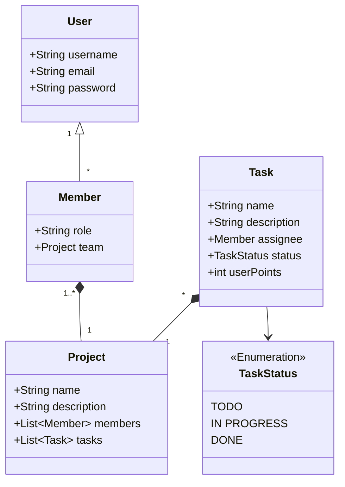

# Object Models &amp; Structure

## Object Models

In Crackling, we use several object to hold the business logic.

- : Define a user who have access to the application.
- : Define a project and regroup `members` and `tasks`.
- : A member is a `User` linked to a `Team`. Member hold information from a `User` but also team-scpecific information.
- : Define a piece of work in a project.

### Schema

## Structure

### File structure

### Logical structure

The logical structure of the API is based on HATEOAS.